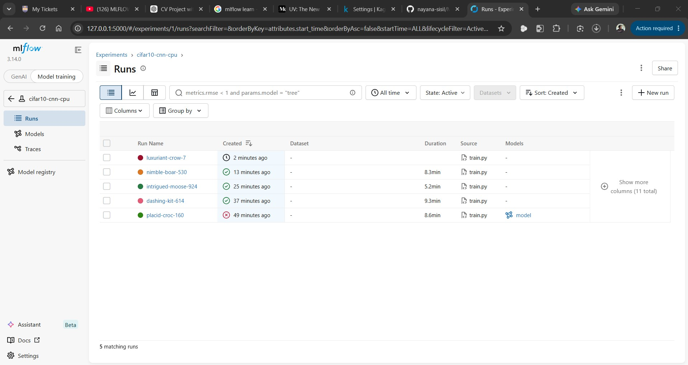
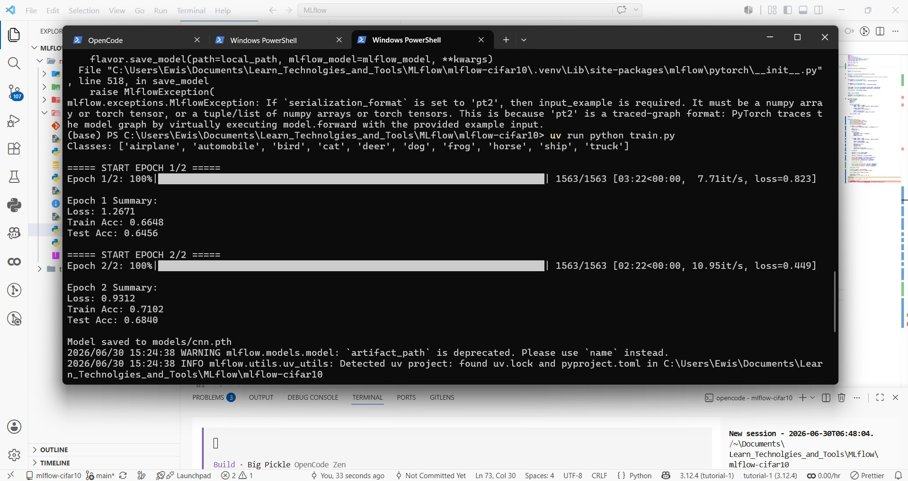
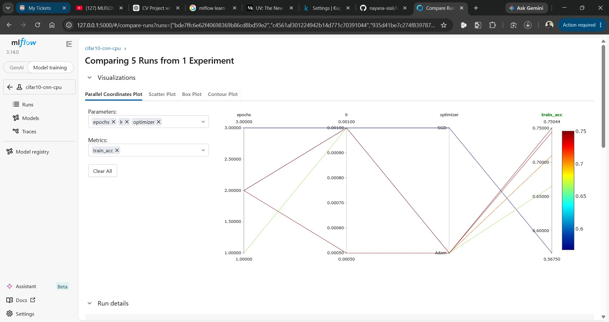
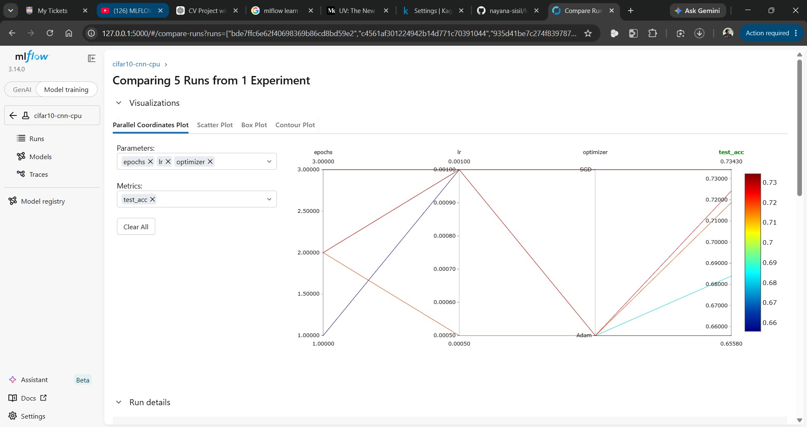
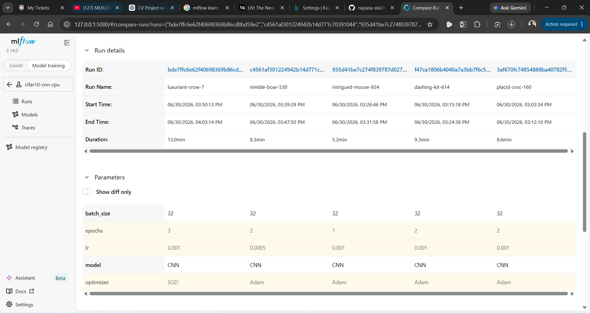
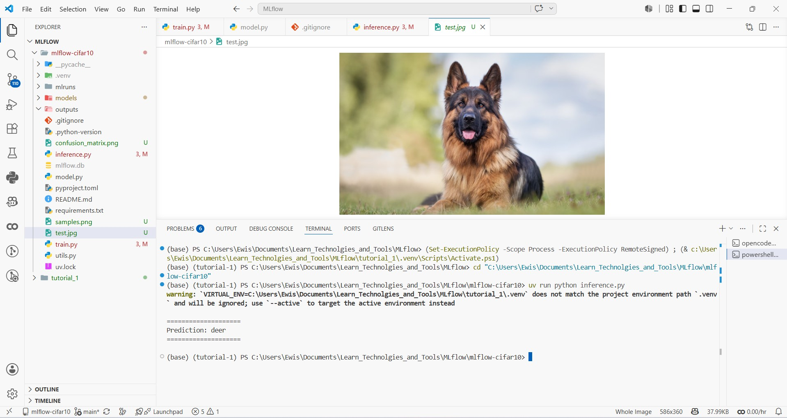

# MLflow CIFAR-10

End to end image classification pipeline using a PyTorch CNN on the CIFAR-10 dataset with MLflow for experiment tracking, visualization, and model management.

## Overview

A Convolutional Neural Network classifier for the CIFAR-10 dataset (10 classes: airplane, automobile, bird, cat, deer, dog, frog, horse, ship, truck). The training loop logs hyperparameters, per epoch metrics, and the trained model artifact to MLflow, enabling run comparison and model versioning. Includes an inference script for testing on new images.

## Dataset

CIFAR-10 consists of 60,000 32x32 RGB images across 10 balanced classes. The dataset is downloaded automatically via torchvision on first run.

## Model Architecture

| Layer | Details |
|-------|---------|
| Conv1 | 3x32, kernel 3, padding 1 -> BatchNorm -> ReLU -> MaxPool 2x2 |
| Conv2 | 32x64, kernel 3, padding 1 -> BatchNorm -> ReLU -> MaxPool 2x2 |
| Conv3 | 64x128, kernel 3, padding 1 -> BatchNorm -> ReLU -> AdaptiveAvgPool 4x4 |
| FC1 | 2048 -> 256 -> ReLU -> Dropout 0.5 |
| FC2 | 256 -> 10 (logits) |

## Tech Stack

- Python, PyTorch, Torchvision
- MLflow (experiment tracking)
- NumPy, Matplotlib, Scikit-learn

## Setup

```bash
pip install -r requirements.txt
```

## Training

```bash
python train.py
```

Each run logs the following:

- **Hyperparameters:** learning rate, optimizer, batch size, epochs, device
- **Metrics per epoch:** training loss, test accuracy
- **Artifacts:** trained model







### Run Comparison



### Experiment Dashboard



## MLflow Tracking UI

```bash
mlflow ui
```

Then open [http://127.0.0.1:5000](http://127.0.0.1:5000) to compare runs, view metrics, and download artifacts.

## Best Configuration

| Parameter | Value |
|-----------|-------|
| Optimizer | Adam |
| Learning Rate | 0.0005 |
| Test Accuracy | 0.75044 (CPU) |

## Inference

```python
from inference import CIFAR10Predictor

predictor = CIFAR10Predictor(run_id="<YOUR_RUN_ID>")
result = predictor.predict("path/to/image.png")
print(result)
# {'class': 'cat', 'class_id': 3, 'probabilities': [...]}
```



## Project Structure

```
mlflow-cifar10/
├── train.py               # Training loop with MLflow logging
├── model.py               # CNN definition
├── utils.py               # Data loaders, accuracy, plotting
├── inference.py           # MLflow model loading and prediction
├── requirements.txt
├── data/                  # CIFAR-10 dataset (auto-downloaded)
├── models/                # Saved model artifacts
├── outputs/               # Logs and plots
├── SccrenShots/           # Experiment screenshots
├── samples.png
└── test.jpg
```
