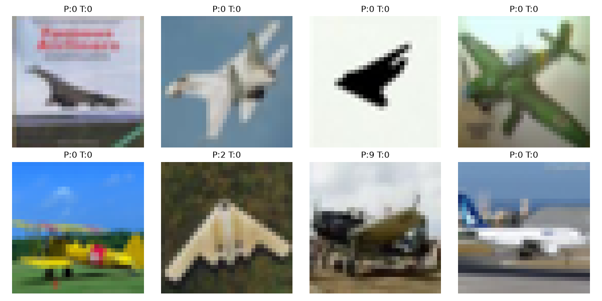
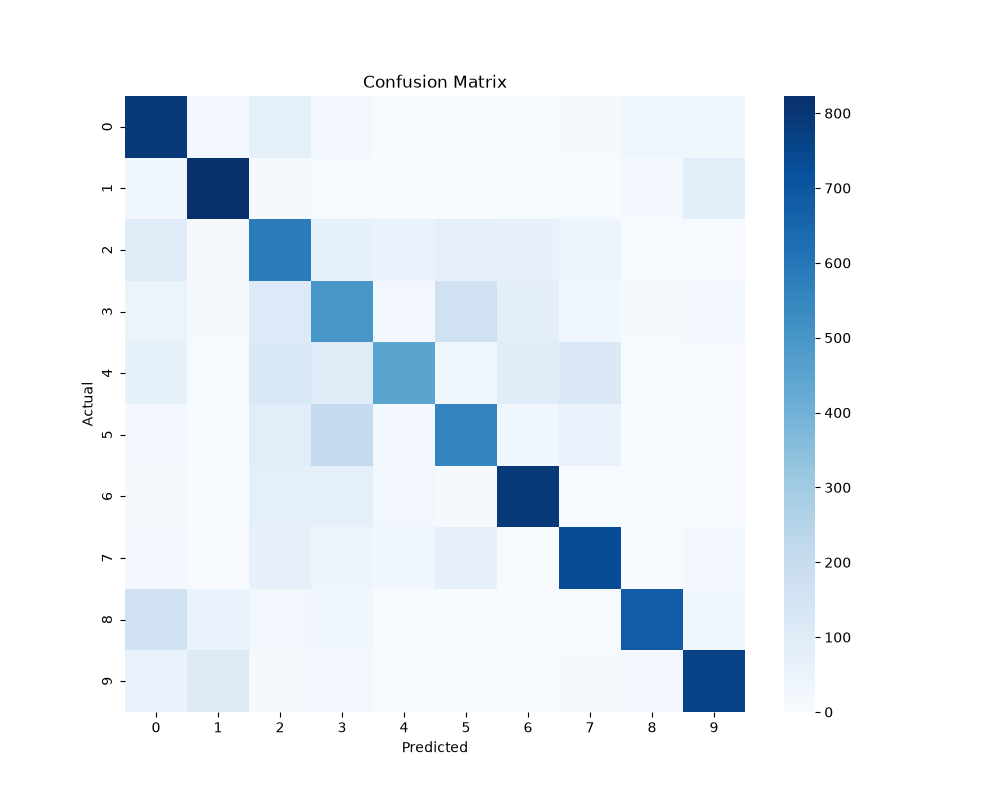

# MLflow CIFAR-10

CIFAR-10 image classification pipeline using PyTorch with MLflow experiment tracking.

## Overview

A CNN-based classifier for the [CIFAR-10](https://www.cs.toronto.edu/~kriz/cifar.html) dataset (10 classes: airplane, automobile, bird, cat, deer, dog, frog, horse, ship, truck). The training loop logs hyperparameters, metrics per epoch, and the trained model artifact to MLflow for experiment comparison and model versioning.

## Dataset Samples



## Model Architecture

| Layer | Details |
|-------|---------|
| Conv1 | 3×32, kernel 3, padding 1 → BatchNorm → ReLU → MaxPool 2×2 |
| Conv2 | 32×64, kernel 3, padding 1 → BatchNorm → ReLU → MaxPool 2×2 |
| Conv3 | 64×128, kernel 3, padding 1 → BatchNorm → ReLU → AdaptiveAvgPool 4×4 |
| FC1 | 2048 → 256 → ReLU → Dropout 0.5 |
| FC2 | 256 → 10 (logits) |

## Setup

```bash
pip install -r requirements.txt
```

## Training

```bash
python train.py
```

Each run logs `batch_size`, `epochs`, `learning_rate`, `device`, and `model` as parameters, and records `train_loss` and `test_accuracy` per epoch.


Artifacts saved to MLflow:


### Comparing Runs


### Experiment Dashboard


## Inference

```python
from inference import CIFAR10Predictor

predictor = CIFAR10Predictor(run_id="<YOUR_RUN_ID>")
result = predictor.predict("path/to/image.png")
print(result)
# {'class': 'cat', 'class_id': 3, 'probabilities': [...]}
```


## Evaluation



## Project Structure

```
mlflow-cifar10/
├── train.py          # Training loop with MLflow tracking
├── model.py          # CNN definition
├── utils.py          # Data loaders, accuracy, plotting
├── inference.py      # MLflow model loading and prediction
├── data/             # CIFAR-10 dataset (auto-downloaded)
├── models/           # Saved model artifacts
├── outputs/          # Logs and plots
└── requirements.txt
```
